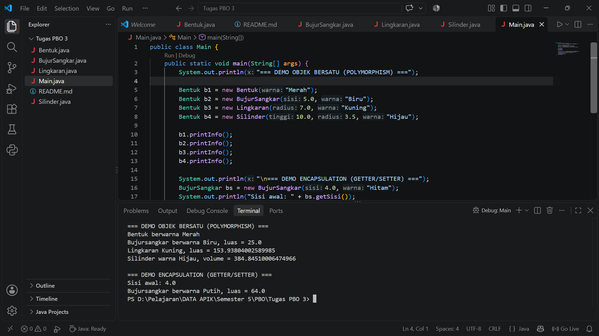

# Latihan/Eksplorasi Materi Inheritance dan Polymorphism

Repositori ini dibuat untuk memenuhi tugas **5C - Latihan/Eksplorasi Materi Inheritance dan Polymorphism** pada mata kuliah Pemrograman Berbasis Objek.

---

## Deskripsi Program
Program ini merupakan implementasi Java yang mengeksplorasi hirarki kelas geometri berdasarkan tiga kelas utama beserta turunan-turunannya:
- `Bentuk` (Superclass utama)
- `BujurSangkar` (Subclass dari `Bentuk`)
- `Lingkaran` (Subclass dari `Bentuk`)
- `Silinder` (Subclass dari `Lingkaran`)

---

## Penerapan Konsep PBO (Object-Oriented Programming)

### 1. Encapsulation (Pengkapsulan)
Encapsulation diterapkan dengan menyembunyikan atribut-atribut internal kelas dan menyediakannya melalui method akses (getter dan setter):
- **Private Attributes**: Atribut seperti `sisi` di kelas `BujurSangkar`, `radius` di kelas `Lingkaran`, dan `tinggi` di kelas `Silinder` dideklarasikan dengan akses modifier `private`.
- **Getter & Setter**: Pengaksesan dan modifikasi nilai atribut dilakukan secara aman menggunakan method seperti `getSisi()`, `setSisi()`, `getRadius()`, `setRadius()`, `getTinggi()`, dan `setTinggi()`.

### 2. Inheritance (Pewarisan)
Inheritance memungkinkan kelas turunan mengoper fungsionalitas dan atribut dari kelas induknya (`extends`):
- `BujurSangkar` dan `Lingkaran` mewarisi atribut `warna` serta method `getWarna()` / `setWarna()` dari superclass `Bentuk`.
- `Silinder` mewarisi atribut `radius` dan method `hitungLuas()` dari kelas induknya, yaitu `Lingkaran`.

### 3. Polymorphism (Polimorfisme)
Polymorphism diterapkan melalui **Redefinisi/Pendefinisian Ulang Method**:
- Method `printInfo()` didefinisikan kembali pada masing-masing subclass (`BujurSangkar`, `Lingkaran`, dan `Silinder`) dengan nama dan parameter yang sama persis seperti pada kelas induk `Bentuk`.
- Pada kelas `Main`, objek-objek subclass diacu menggunakan variabel bertipe superclass `Bentuk`. Saat method `printInfo()` dipanggil, program secara otomatis menjalankan versi method milik instance asli objek tersebut.

---

## Struktur File Repositori

```text
.
├── Bentuk.java         # Superclass utama
├── BujurSangkar.java   # Subclass dari Bentuk
├── Lingkaran.java      # Subclass dari Bentuk
├── Silinder.java       # Subclass dari Lingkaran
├── Main.java           # Main class untuk eksekusi dan pengujian objek
└── README.md           # Dokumentasi tugas
```
## Screenshot Hasil Eksekusi Program


